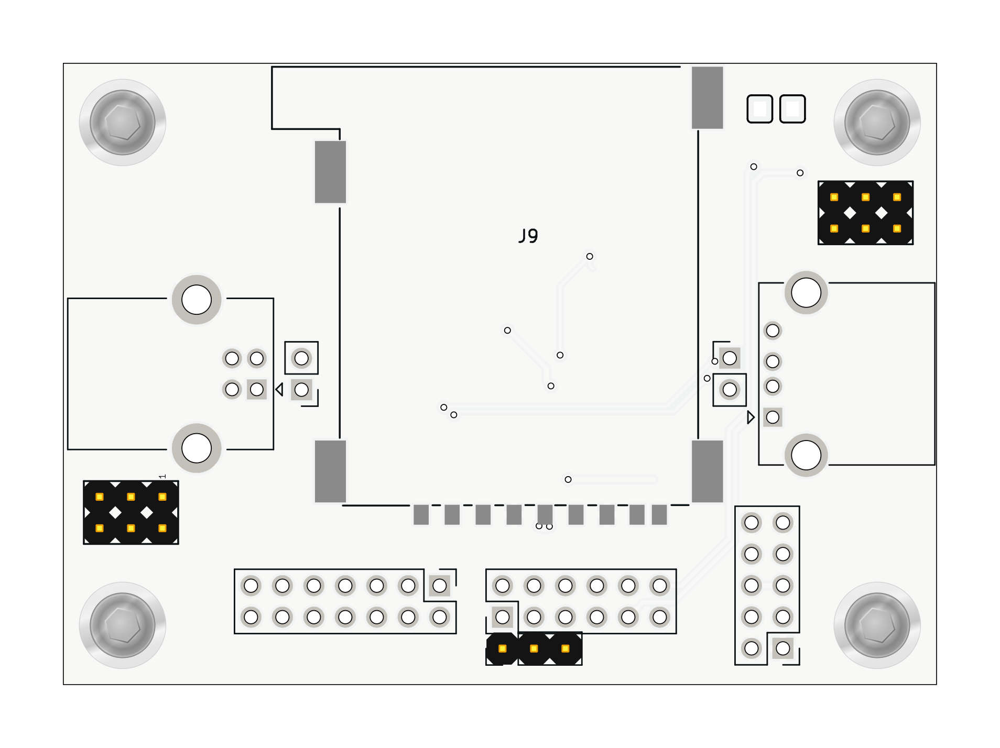
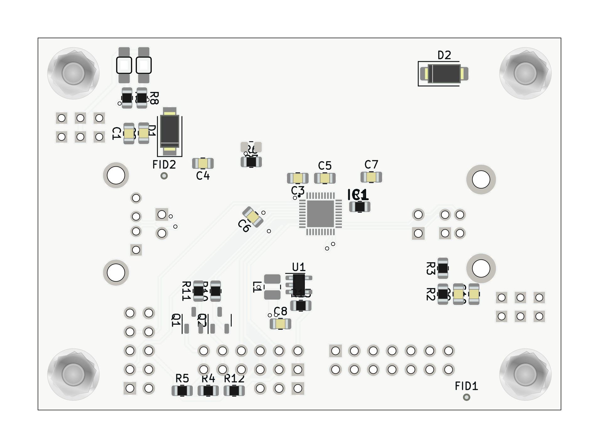

# USBSDREADER01 - USB to SD Card Reader Module

## Overview
This module is designed to interface USB devices with SD cards, utilizing the MAX14502AETL integrated circuit. The MAX14502AETL supports both full-speed USB communication (12Mbps) for bridget devices and Hi-Speed USB communication (480Mbps) as SDcard reader, providing a versatile solution for various USB to SD card reading applications.

## Features
- **USB 2.0 Hi-Speed and Full-Speed Compliant**
- **Supports SDHC Cards**
- **Internal Hi-Speed USB SD Card Reader**
- **On-Chip Termination and Pullup Resistors**
- **Internal SD Switches for Multiplexing Two SD Cards**
- **Clock Input Frequencies: 26MHz, 19.2MHz, 13MHz, 12MHz**
- **Low-Amplitude TCXO Signal Compatibility**
- **No Power-Supply Sequencing Required**
- **1.8V to 3.3V I/O Host Microprocessor Compatibility**
- **Simple GPIO Control Mode**
- **I2C Control for Multiple Configuration Options**
- **Power-On Reset/Brown-Out Reset**

## Technical Specifications
- **Supply Voltage (VCC):** 2.4V to 3.6V
- **Logic Interface Supply Voltage (VIO):** 1.5V to 3.6V
- **USB Supply Voltage (VTM):** 2.91V to 3.4V
- **Operating Temperature Range:** -40°C to +85°C
- **Package:** 40-pin TQFN

## Pin Description
- **I2C_SEL:** I2C Select Input
- **SCL:** I2C Serial-Clock Input
- **SDA:** I2C Serial-Data I/O
- **ADD:** I2C Address Selection Input
- **BERR/INT:** Card Reader Error/Interrupt Output
- **BUSY:** Busy Output
- **MODE:** Card Reader/Pass Thru Mode Select Input
- **RST:** Reset Input
- **FREF:** Frequency Input (12MHz/13MHz/19.2MHz/26MHz)

## Schematic

## Applications
- Data loggers
- Cameras
- Flight computers

## Installation and Usage
1. **Power Supply:**
   - Connect the power supply to the VCC and GND pins.
   - Ensure the supply voltage is within the specified range (2.4V to 3.6V).

2. **USB Connection:**
   - Connect the USB data lines (D+ and D-) to the corresponding pins on the module.
   - Use the USB_B and USB_A connectors for input and output respectively.

3. **SD Card Connection:**
   - Connect the SD card signals (CMD, CLK, DAT0-3) to the corresponding pins on the module.
   - Ensure proper insertion and alignment of the SD card.

4. **I2C Configuration:**
   - If I2C control is needed, connect the I2C_SEL, SCL, and SDA pins appropriately.
   - Configure the I2C address using the ADD pin.

5. **Operation Modes:**
   - Select Pass Thru or Card Reader mode using the MODE pin.
   - Reset the device using the RST pin if necessary.

For detailed electrical characteristics and operational guidance, refer to the [MAX14502AETL Datasheet](./doc/datasheet/Maxim_Integrated-MAX14502AETL+-datasheet.pdf).

## Support
For further assistance, visit [MLAB](https://www.mlab.cz/) or contact our support team at support@mlab.cz.

